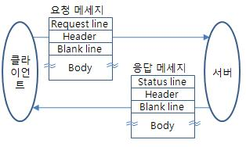
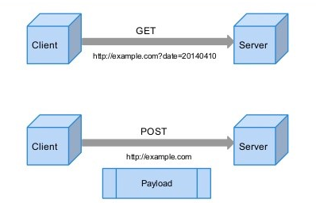

# HTTP 프로토콜

- Hypertext Transfer Protocol
- 인터넷에서 데이터를 주고받기 위한 통신 규약이며, 주로 웹 브라우저와 웹 서버 간에 HTML 문서와 같은 리소스를 전송하는데 사용됩니다.
- HTTP는 클라이언트와 서버 사이의 요청(Request)과 응답(Response)으로 이루어진 모델을 가지고 있으며, 무상태(Stateless) 프로토콜이기 때문에 각각의 요청은 서로 독립적으로 처리되고 세션 상태를 유지하지 않습니다.

# HTTP의 요청/응답 모델

- HTTP는 클라이언트와 서버 간의 요청(Request)과 응답(Response)으로 이루어진 요청/응답 모델을 가지고 있습니다. 이 모델은 웹 브라우저와 웹 서버 사이에서 데이터를 주고받는 데 사용되며, 웹 페이지를 요청하고 서버로부터 해당 페이지에 필요한 리소스를 받아오는 과정을 설명합니다.

  - 요청(Request):

    - 클라이언트(웹 브라우저)가 서버에게 데이터를 요청합니다.
    - 요청은 HTTP 메서드(GET, POST, PUT, DELETE 등)와 URI(Uniform Resource Identifier)로 구성됩니다.
    - GET 메서드는 정보를 요청할 때 사용되며, 주로 웹 페이지 조회에 사용됩니다.
    - POST 메서드는 서버로 데이터를 전송할 때 사용되며, 주로 데이터를 생성하거나 수정하는 데 사용됩니다.

  - 응답(Response):

    - 서버는 클라이언트의 요청을 처리하고 그에 대한 결과를 응답으로 반환합니다.
    - 응답은 상태 코드, 헤더, 본문으로 구성됩니다.
    - 상태 코드는 요청이 성공했는지, 오류가 발생했는지 등의 요청 처리 상태를 나타내는 3자리 숫자입니다. (예: 200 OK, 404 Not Found, 500 Internal Server Error 등)
    - 헤더는 요청과 응답의 부가적인 정보를 담고 있으며, 메시지의 타입, 길이, 인증, 압축 등을 지정합니다.
    - 본문은 요청한 데이터나 웹 페이지의 내용 등 실제 데이터를 담고 있습니다.

  - 동작 과정:

    - 클라이언트가 웹 브라우저를 통해 웹 페이지를 요청합니다. 이 요청은 HTTP 메서드와 요청한 웹 페이지의 주소(URI)를 포함합니다.
    - 서버는 요청을 받아 해당 웹 페이지에 필요한 리소스를 검색하고 처리합니다.
    - 처리 결과를 HTTP 응답으로 반환합니다. 응답에는 상태 코드, 헤더, 본문이 포함되며, 클라이언트는 이를 받아서 화면에 표시하거나 처리합니다.
    - 클라이언트는 받은 응답을 기반으로 웹 페이지를 렌더링하고, 필요한 리소스(이미지, 스크립트, 스타일시트 등)를 추가로 요청하여 화면에 표시합니다.

# HTTP 메서드 중 GET과 POST의 차이

- 사용 목적:

  - GET: 정보를 서버로 요청하기 위해 사용됩니다. 주로 서버로부터 데이터를 조회하거나 검색하는데 사용됩니다.
  - POST: 서버로 데이터를 전송하기 위해 사용됩니다. 주로 사용자가 입력한 데이터를 서버로 보내거나, 리소스를 생성하거나 수정하는데 사용됩니다.

- 데이터 전송 방식:

  - GET: 요청한 데이터를 URL의 쿼리 매개변수에 포함시켜 전송합니다. 즉, 데이터가 URL 뒤에 '?'와 함께 키-값 쌍으로 전달됩니다. 예를 들면 http://example.com/search?query=apple과 같이 전달됩니다.
  - POST: 요청한 데이터를 HTTP 메시지의 본문에 담아서 전송합니다. 데이터가 URL에 노출되지 않기 때문에 GET보다 보안적으로 우수합니다.

- 데이터 길이 제한:

  - GET: URL에 데이터가 노출되므로 데이터 길이에 제한이 있습니다. 각 브라우저 및 서버에 따라 제한은 다를 수 있지만 일반적으로 약 2,048자로 제한됩니다.
  - POST: HTTP 메시지의 본문에 데이터를 담기 때문에 길이 제한이 거의 없습니다. 서버 측 설정에 따라 데이터 크기 제한을 둘 수 있지만 일반적으로 더 많은 데이터를 전송할 수 있습니다.

- 캐싱:

  - GET: 요청 결과가 캐시될 수 있습니다. 캐시된 데이터는 동일한 GET 요청에 대해서는 서버로 다시 요청하지 않고, 캐시에서 바로 응답할 수 있습니다.
  - POST: 요청 결과는 캐시되지 않습니다. POST 요청은 서버에 데이터를 변경하거나 부작용이 있을 수 있기 때문에 결과가 캐시되면 문제가 발생할 수 있습니다.

- 기타:

  - GET: 브라우저에서 주소를 입력하거나 하이퍼링크를 클릭하여 GET 요청을 보낼 수 있습니다.
  - POST: HTML <form> 요소를 사용하여 POST 요청을 보내는 것이 일반적입니다. 또한 XMLHttpRequest나 Fetch API를 사용하여 JavaScript 코드를 통해 POST 요청을 보낼 수도 있습니다.

# HTTP 메서드 중 PUT과 PATCH의 차이

- 사용 목적:

  - PUT: 리소스를 완전히 대체하기 위해 사용됩니다. 요청한 데이터로 해당 리소스를 덮어씌웁니다.
  - PATCH: 리소스의 일부를 수정하기 위해 사용됩니다. 요청한
    데이터로 리소스의 일부를 변경하거나 업데이트합니다.

- 데이터 처리:

  - PUT: 요청한 데이터로 해당 리소스를 완전히 대체합니다. 서버에서는 요청된 데이터로 리소스를 덮어쓰게 됩니다. 즉, 요청한 데이터와 동일한 형태의 리소스가 서버에 존재하게 됩니다.
  - PATCH: 요청한 데이터로 리소스의 일부만 변경하게 됩니다. 서버에서는 요청된 데이터를 사용하여 리소스를 수정하고, 나머지 부분은 그대로 유지합니다.

- 리소스 업데이트:

  - PUT: 클라이언트가 전송한 데이터로 리소스를 완전히 대체하기 때문에 클라이언트가 리소스의 현재 상태를 모르더라도 새로운 데이터로 리소스가 업데이트됩니다.
  - PATCH: 리소스의 일부만 변경하므로 클라이언트는 리소스의 현재 상태를 알아야 정확한 업데이트를 수행할 수 있습니다.

- Idempotent (멱등) 특성:

  - PUT: 멱등 특성을 가집니다. 동일한 PUT 요청을 여러 번 실행하더라도 리소스의 상태는 동일하게 유지됩니다.
  - PATCH: 일반적으로 멱등하지 않습니다. 여러 번 실행되면 리소스의 상태가 변경될 수 있습니다.

- 안전성:

  - PUT: 일반적으로 PUT 요청은 서버에 영향을 미치기 때문에 서버의 리소스를 변경하거나 부작용이 있는 경우에 사용됩니다.
  - PATCH: 리소스의 일부만 변경하므로 PUT보다는 더 안전하게 사용할 수 있습니다.

# HTTP 상태 코드(HTTP status code)

- 클라이언트가 보낸 요청에 대한 서버의 응답 상태를 나타내는 3자리 숫자로 구성된 코드입니다.
- 각각의 상태 코드는 특정 의미와 처리 결과를 가지고 있으며, 클라이언트가 요청을 어떻게 처리해야 하는 지를 알려줍니다.
- 상태 코드는 HTTP 응답 메시지의 첫 번째 줄에 포함되어 있습니다.

- 상태 코드

  - 1xx (Informational): 요청이 수신되었고, 처리가 계속 진행 중인 상태를 나타냅니다.
  - 2xx (Successful): 요청이 성공적으로 처리되었음을 나타냅니다.
  - 3xx (Redirection): 요청을 완료하기 위해 추가 동작이 필요한 상태를 나타냅니다.
  - 4xx (Client Errors): 클라이언트의 요청에 오류가 있거나 요청을 처리할 수 없는 상태를 나타냅니다.
  - 5xx (Server Errors): 서버에서 요청을 처리하는 동안 오류가 발생한 상태를 나타냅니다.

- 일반적으로 많이 사용되는 HTTP 상태 코드
  - 200 OK: 요청이 성공적으로 처리되었습니다.
  - 201 Created: 요청에 의해 새로운 리소스가 생성되었습니다.
  - 204 No Content: 요청이 성공적으로 처리되었지만, 응답에 별도의 컨텐츠가 없습니다.
  - 400 Bad Request: 클라이언트의 요청이 잘못되었거나 서버가 요청을 이해하지 못했습니다.
  - 404 Not Found: 요청한 리소스가 서버에서 찾을 수 없습니다.
  - 500 Internal Server Error: 서버 내부 오류로 인해 요청이 처리되지 않았습니다.

# HTTP 헤더(HTTP header)

- HTTP 요청과 응답 메시지에 포함되는 메타데이터
- 클라이언트와 서버가 서로에게 추가 정보를 전달하는 역할을 합니다.
- HTTP 헤더는 HTTP 메시지의 첫 번째 줄에 위치하며, 요청과 응답의 부가적인 정보를 제공합니다.
- HTTP 헤더는 메시지의 유형에 따라 역할이 다릅니다
- 일반 헤더(General Header):

  - Cache-Control: 캐싱 정책을 지정합니다.
  - Connection: 클라이언트와 서버 간의 연결 옵션을 설정합니다.
  - Date: 메시지가 생성된 날짜와 시간을 나타냅니다.
  - Transfer-Encoding: 메시지의 전송 인코딩 방식을 지정합니다.

- 요청 헤더(Request Header):

  - User-Agent: 클라이언트의 사용자 에이전트(브라우저 등) 정보를 나타냅니다.
  - Host: 요청한 호스트의 도메인 이름 또는 IP 주소를 나타냅니다.
  - Accept: 클라이언트가 지원하는 컨텐츠 유형을 서버에 알려줍니다.
  - Authorization: 클라이언트의 인증 정보를 서버에 전달합니다.

- 응답 헤더(Response Header):

  - Server: 서버의 소프트웨어 정보를 나타냅니다.
  - Content-Type: 응답으로 보내진 데이터의 형식을 지정합니다.
  - Content-Length: 응답 데이터의 크기를 바이트 단위로 나타냅니다.
  - Location: 리다이렉트된 페이지의 주소를 나타냅니다.

- 엔티티 헤더(Entity Header):

  - Content-Encoding: 엔티티 데이터의 압축 방식을 지정합니다.
  - Content-Language: 엔티티 데이터의 언어를 지정합니다.
  - Last-Modified: 엔티티 데이터가 마지막으로 수정된 날짜와 시간을 나타냅니다.

-> HTTP 헤더를 사용하여 클라이언트와 서버는 메시지에 대한 추가 정보를 전달하고, 캐싱, 압축, 인증 등과 같은 기능을 제어할 수 있습니다.

# HTTP의 무상태성(HTTP Statelessness)

- 클라이언트와 서버 간의 각각의 요청이 서로 독립적으로 처리되고 이전 요청과 관련된 정보를 서버가 기억하지 않는다는 것을 의미합니다.
- 각각의 요청은 과거의 요청과 아무런 연관이 없으며, 이전 요청으로 인해 서버에 상태 정보가 유지되지 않습니다.
- 특징

  - 클라이언트-서버 간의 독립성: 각각의 HTTP 요청은 서버가 독립적으로 처리됩니다. 이전 요청과 상관없이 각 요청은 자체적으로 완전한 정보를 가지고 있습니다.

  - 서버에 상태 정보 유지 안함: 서버는 클라이언트의 상태를 기억하지 않습니다. 즉, 클라이언트의 이전 요청과 관련된 정보나 세션 정보를 서버가 저장하지 않습니다.

  - 스케일링과 확장성 용이성: 무상태성은 서버의 확장성을 높여줍니다. 서버는 특정 클라이언트와 연결된 정보를 기억하지 않기 때문에 새로운 요청이 추가되더라도 서버의 상태에 영향을 미치지 않습니다.

-> 동시에 클라이언트와 서버 간의 상태를 유지해야 하는 경우, 예를 들어 로그인 상태나 세션 정보를 관리해야 할 때는 추가적인 메커니즘(ex) 쿠키, 세션, 토큰 등)을 사용하여 상태 정보를 유지해야 합니다.

# HTTP Keep-Alive

- HTTP 프로토콜의 기능 중 하나로, 한 번의 TCP 연결을 유지하여 여러 개의 HTTP 요청과 응답을 처리하는 매커니즘을 말합니다.
- 일반적으로 HTTP 요청과 응답은 각각의 요청에 대해 새로운 TCP 연결을 맺고 종료되는데, Keep-Alive를 사용하면 여러 요청과 응답을 동일한 TCP 연결을 통해 처리함으로써 연결의 지연과 자원의 낭비를 줄일 수 있습니다.
- Keep-Alive를 사용하는 경우의 특징

  - 지속 연결(Persistent Connection): Keep-Alive를 사용하면 한 번의 TCP 연결을 유지하여 여러 개의 HTTP 요청과 응답을 처리합니다. 연결이 유지되는 동안 클라이언트와 서버 간의 데이터 교환은 계속해서 이루어집니다.

  - 커넥션 지연 최소화: TCP 연결을 맺는 과정은 비용이 많이 들고, 시간이 소요됩니다. Keep-Alive를 사용하면 이 과정을 여러 번 반복하지 않고 한 번만 수행하므로, 다음 요청에 대한 응답 시간을 줄일 수 있습니다.

  - 리소스 공유: 동일한 TCP 연결을 사용하면 동시에 여러 요청을 처리할 수 있으므로 서버의 리소스를 효율적으로 활용할 수 있습니다.

  -> Keep-Alive는 많은 HTTP 요청과 응답이 발생할 때 성능 향상을 가져오지만, 무한정 연결을 유지하는 것은 자원 낭비를 초개할 수 있습니다.

  # HTTP 파이프라이닝(HTTP pipelining)

  - HTTP 프로토콜의 기능 중 하나로, 여러 개의 HTTP 요청을 연속적으로 보내고, 그에 대한 응답을 기다리지 않고 독립적으로 처리하는 매커니즘을 말합니다.
  - 일반적으로 HTTP 요청과 응답은 요청이 완료된 후에야 다음 요청을 보내고 응답을 받아야 하는데, 파이프라이닝을 사용하면 요청과 응답이 독립적으로 처리되기 때문에 처리 시간을 단축시킬 수 있습니다.
  - 파이프라이닝을 사용하는 경우의 특징

    - 연속적인 요청 전송: 클라이언트는 여러 개의 HTTP 요청을 한 번에 연속적으로 서버로 전송합니다. 이 때, 요청들은 순서대로 전송되며 각 요청은 독립적으로 처리될 수 있어야 합니다.

    - 응답 순서: 서버는 받은 순서대로 요청들을 처리하고, 응답을 독립적으로 클라이언트로 전송합니다. 따라서 클라이언트는 요청들의 응답을 기다리지 않고 바로 다음 요청을 전송할 수 있습니다.

    - 응답 해석: 클라이언트는 응답들을 받은 순서대로 해석하여 처리합니다. 만약 응답이 오래 걸리는 요청이 있다면, 이후 요청들의 응답도 지연될 수 있습니다.

-> 파이프라이닝은 여러 개의 작은 요청들을 빠르게 보내고 처리할 때 성능 향상을 가져오지만, 일부 요청이 응답이 오래 걸리는 경우 다른 요청들도 기다려야 하는 문제가 있을 수 있습니다.

# HTTP/1.1, HTTP/2, HTTP/3

- HTTP/1.1

      * HTTP/1.1은 가장 오래된 버전으로, 1997년에 표준으로 채택되었습니다. 많은 웹 사이트에서 사용되고 있습니다.

  텍스트 기반 프로토콜로, 요청과 응답이 텍스트 형태로 주고받습니다.
  지속 연결을 사용하지 않으면 매 요청마다 새로운 TCP 연결을 맺어야 하기 때문에 느린 로딩 시간과 지연이 발생할 수 있습니다.
  파이프라이닝과 멀티플렉싱을 지원하지 않아 요청과 응답이 순차적으로 처리되어 성능에 한계가 있습니다.

- HTTP/2

      * HTTP/2는 2015년에 발표된 HTTP/1.1의 개선 버전입니다.

  바이너리 기반 프로토콜로, 요청과 응답이 바이너리 형태로 주고받습니다. 이로 인해 더 효율적이고 빠른 데이터 전송이 가능합니다.
  멀티플렉싱을 지원하여 한 개의 TCP 연결로 여러 요청과 응답을 동시에 처리할 수 있습니다. 이로 인해 성능이 크게 향상되었습니다.
  헤더 압축을 지원하여 요청과 응답의 크기를 줄이고 더 효율적인 데이터 전송이 가능합니다.

- HTTP/3

      * HTTP/3는 2020년에 발표된 최신 버전으로, TCP 대신 QUIC 프로토콜을 기반으로 합니다.

  QUIC은 UDP를 사용하여 더 빠른 연결 설정과 데이터 전송을 제공합니다. TCP의 문제점을 개선하여 더 낮은 지연과 더 빠른 성능을 가져옵니다.
  다중 경로로 데이터를 전송하여 패킷 손실 시 다른 경로를 통해 재전송하여 신뢰성을 확보합니다.
  HTTP/2와 마찬가지로 멀티플렉싱과 헤더 압축을 지원하여 성능을 향상시킵니다.

##### 참고

- https://ko.wikipedia.org/wiki/HTTP

- https://aws.amazon.com/ko/compare/the-difference-between-https-and-http/

* http://www.ktword.co.kr/test/view/view.php?m_temp1=648
