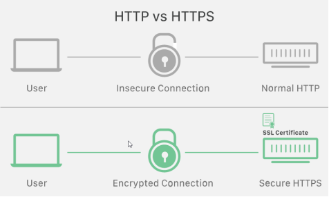

# HTTPS

HTTPS(하이퍼텍스트 전송 프로토콜 보안)는 HTTP 프로토콜의 보안 버전으로, 웹 브라우저와 웹 서버 간의 데이터 통신을 암호화하여 보안성을 확보하는 프로토콜입니다. HTTPS는 SSL(보안 소켓 계층) 또는 TLS(전송 계층 보안) 프로토콜을 사용하여 데이터를 암호화하고, 인증서를 통해 웹 서버의 신원을 확인합니다. 이를 통해 중간에 제3자가 데이터를 가로채거나 변조하는 것을 방지하여 보안을 강화합니다.

## SSL/TLS

SSL(보안 소켓 계층)과 TLS(전송 계층 보안)는 모두 암호화와 데이터 보안을 제공하는 프로토콜입니다. 이 둘은 거의 동일한 기능을 수행하지만 이름만 다르며, SSL은 오래된 버전이고 TLS는 더 최근 버전입니다. 따라서 현재는 TLS가 주로 사용되며, 일반적으로 SSL/TLS라고 언급하면 SSL과 TLS를 모두 포함하는 의미로 사용됩니다.

## HTTPS 암호화 과정 (+ SSL 핸드셰이크)

HTTPS 암호화 과정은 SSL 핸드셰이크(Handshake)라고 불리는 단계를 포함합니다. SSL 핸드셰이크는 클라이언트와 서버 간의 연결을 설정하고 암호화에 사용할 암호와 알고리즘을 협상하는 과정입니다.

- HTTPS 암호화 과정입니다:

1. 클라이언트가 서버에 HTTPS 연결을 요청합니다.
2. 서버는 인증서를 클라이언트에게 제공합니다. 이 인증서는 서버의 공개키와 서버의 정보가 포함되어 있습니다.
3. 클라이언트는 서버의 인증서를 확인하고, 서버의 공개키를 얻습니다.
4. 클라이언트는 무작위로 대칭키(세션 키)를 생성하고, 서버의 공개키로 이 대칭키를 암호화하여 서버에 보냅니다.
5. 서버는 자신의 개인키를 사용하여 클라이언트가 보낸 대칭키를 복호화합니다.
6. 이후 클라이언트와 서버는 암호화된 대칭키를 사용하여 데이터를 주고받습니다. 대칭키는 클라이언트와 서버만 알고 있으므로, 중간에 제3자가 대칭키를 알아내어 데이터를 해독하는 것을 방지할 수 있습니다.

# DNS

DNS(도메인 이름 시스템)은 사람이 이해하기 쉬운 도메인 이름(예: www.example.com)을 컴퓨터가 이해할 수 있는 IP 주소(예: 203.0.113.1)로 변환해주는 시스템입니다. 인터넷 사용자가 도메인 이름을 입력하면, DNS는 이 도메인 이름을 해당 도메인의 IP 주소로 매핑하여 사용자의 브라우저가 해당 웹 사이트에 접근할 수 있도록 도와줍니다.

## DNS 작동 방식

1. 사용자가 브라우저에 도메인 이름을 입력하여 웹 사이트에 접근하려고 합니다.
2. 사용자의 컴퓨터는 먼저 로컬 DNS 캐시를 확인하여 해당 도메인 이름에 대한 IP 주소가 이미 저장되어 있는지 확인합니다. 캐시에 없는 경우, 인터넷으로 DNS 질의를 전송합니다.
3. 사용자의 컴퓨터는 인터넷 서비스 제공자(ISP)의 DNS 서버에 도메인 이름을 질의합니다.
4. ISP의 DNS 서버는 최상위 도메인(.com, .net 등)의 DNS 서버에 도메인 이름을 질의합니다.
5. 최상위 도메인의 DNS 서버는 다음 단계로 내려가며, 도메인 이름에 해당하는 IP 주소를 가지고 있는 하위 도메인의 DNS 서버에 질의합니다.
6. 최종적으로 해당 도메인 이름에 대한 IP 주소를 가지고 있는 DNS 서버가 찾아내어, 그 IP 주소를 ISP의 DNS 서버에 반환합니다.
7. ISP의 DNS 서버가 사용자의 컴퓨터에게 IP 주소를 전달합니다.
8. 사용자의 컴퓨터는 이제 해당 IP 주소를 사용하여 웹 사이트에 접속합니다.

## DNS 질의 종류

- **재귀적(Recursive) 질의:** 사용자의 컴퓨터가 로컬 DNS 캐시에 도메인 이름에 해당하는 IP 주소를 찾지 못하면, 사용자의 컴퓨터는 ISP의 DNS 서버에 도메인 이름을 질의합니다. 이때, ISP의 DNS 서버는 계층적으로 다른 DNS 서버에 도메인 이름 질의를 전달하고, 최종적으로 사용자의 컴퓨터에게 IP 주소를 반환하는 방식입니다.

- **반복적(Iterative) 질의:** DNS 서버가 다른 DNS 서버에 도메인 이름 질의를 전달하면서, 해당 도메인 이름에 대한 IP 주소를 찾을 때까지 질의를 반복하는 방식입니다. 최종적으로 사용자의 컴퓨터가 IP 주소를 얻게 됩니다.

# UDP

UDP(사용자 데이터그램 프로토콜)는 전송 계층 프로토콜 중 하나로, 데이터를 비신뢰적으로, 즉 신뢰성 없이 전송하는 방법을 제공합니다. UDP는 데이터를 보내고 받는데에 있어서 신뢰성과 순서의 보장을 하지 않습니다. 이는 일부 데이터가 손실될 수 있으며, 전송 순서가 바뀔 수 있다는 의미입니다. 하지만 이러한 특징 때문에 TCP보다 더 빠르고 경량화된 프로토콜로 사용될 수 있습니다.

## UDP 체크섬

UDP 체크섬은 UDP 헤더와 데이터를 포함하여 전송되는 패킷의 오류를 감지하는 데 사용되는 값입니다. 전송되는 데이터에 오류가 있는지 확인하기 위해 데이터의 일부를 더하여 체크섬 값을 계산합니다. 수신측은 체크섬을 다시 계산하여 송신측과 비교하여 오류 여부를 판단합니다. 오류가 발견되면 패킷은 재전송되어 신뢰성이 확보될 수 있습니다.

# 신뢰적 데이터 전송의 원리

## 전송 후 대기 프로토콜이 뭘까요?

전송 후 대기 프로토콜은 데이터의 전송이 완료된 후에도 송신 측이 수신 측으로부터 확인 응답을 받을 때까지 대기하는 프로토콜입니다. 가장 대표적인 예로 TCP(전송 제어 프로토콜)가 있습니다. TCP는 전송된 패킷에 대한 확인 응답(ACK)을 수신하지 않으면 재전송을 시도하여 데이터의 신뢰성을 보장합니다.

## 파이프라인 프로토콜이 뭘까요?

파이프라인 프로토콜은 여러 개의 데이터 패킷이 한 번에 연이어 전송되는 기술을 의미합니다. TCP는 파이프라이닝을 사용하여 한 패킷의 확인 응답을 받지 않고도 다음 패킷을 전송하는 방식으로 성능을 향상시킬 수 있습니다. 이렇게 파이프라이닝을 사용하면 전송 지연이 감소하고 네트워크 대역폭을 효율적으로 사용할 수 있습니다. 하지만 파이프라이닝은 순서가 바뀌거나 중간에 패킷이 손실될 경우, 수신 측에서 패킷을 재정렬하거나 재전송을 요청해야 할 수도 있어서 주의가 필요합니다.
